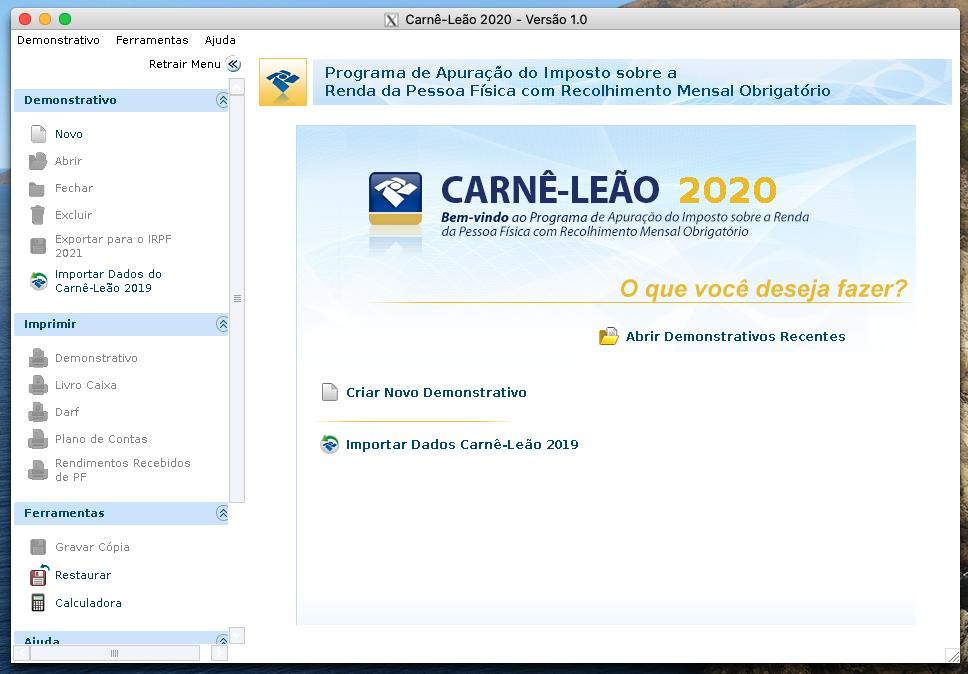

# Executando o programa Carnê Leão em container Docker

## Introdução

O prazo para retificação da Declaração de Ajuste Anual do IRPF é de 5 anos, período
no qual pode ser necessário utilizar o programa Carnê Leão do ano exercício em questão.

O programa `Carnê Leão 2020`, distribuído pela Receita Federal do Brasil, ou RFB,
é utilizado para declaração de rendimentos e geraçãodo DARF mensal (carnê-leão).

Vantagens da utilização do programa Carnê Leão em container:
* Instalar o aplicativo sem fazer alterações aos seu ambiente java
* Evitar possíveis problemas de compatibilidade ocasionados por atualizações no Java
* Executar o programa em qualquer sistema operacional compatível com Docker
* Pode utilizar arquivos previamente gerados pela aplicação rodando de maneira normal no caminho padrão `/Users/nome_usuario/Documents/ProgramasRFB/LEAO2020`



## Escopo

As orientações aqui contidas se referem à utilização do programa Carnê Leão em
computadores Apple Mac.

## Pré-requisitos

A instalação dos programas a seguir é necessária p/uso do Carnê Leão em container:
* `brew`: Gerenciador de pacotes utilizado para a instalação dos pré-requisitos
* `Docker`: plataforma onde o container será executado
* `socat`: ferramenta para relay de conexões tcp
* `XQuartz`: servidor do gerenciador de janelas X.Org para MacOS

Também será necessária a existência da pasta para armazenamento dos dados do
programa. O caminho padrão da pasta dos programas da RFB, como o Carnê Leão é:

* `/Users/alisio/Documents/ProgramasRFB`

## Instalação

Execute o shell script `instalar.sh` para ums instalação mais simples. Caso prefira
executar os comandos manualmente, execute o código a seguir no terminal do seu Mac:

### Gerenciador de pacotes `Brew`
```sh
/bin/bash -c "$(curl -fsSL https://raw.githubusercontent.com/Homebrew/install/HEAD/install.sh)"
```
### Formulas e Casks do Brew

```sh
requisitos=("docker" "socat" "xquartz")
dev_eth='en0'
for requisito in ${requisitos[@]}; do
  [[ ! -f `which ${requisito}` ]] && brew install $requisito
done
```

### Criando a pasta dos documentos da RFB
```sh
mkdir -p ${HOME}/Documents/ProgramasRFB
```

### Construindo a imagem docker
```sh
docker build --rm -t alisio/carneleao2020 https://github.com/alisio/carneleao2020-container.git
```

## Executando o container

Execute o shell script `carneleao2020.sh` para iniciar o container. Caso prefira
executar os comandos manualmente, inicie o container colando as linhas a seguir no
terminal do seu Mac:

### Iniciar o `socat` em background

```sh
socat TCP-LISTEN:6000,reuseaddr,fork UNIX-CLIENT:\"$DISPLAY\" &
```

## Inicialização do Container Carnê Leão

Troque o texto `ENDERECO_IP` pelo endereço IP do seu Mac (exemplo: 192.168.0.10)
e execute o comando:
```sh
docker run  --rm \
  -e DISPLAY=ENDERECO_IP:0 \
  -v ${HOME}/Documents/ProgramasRFB/LEAO2020:/root/ProgramasRFB/LEAO2020 \
  alisio/carneleao2020
```

## Limitações

Os testes foram feitos no MacOS, porém é possível executar o container em qualquer
sistema operacional com o Docker Engine instalado.

Os testes foram efetuados com sucesso em um Macbook Air com processador intel rodando:
* Mac OS Catalina
* Docker 20.10.6
* Socat 1.7.4.1
* XQuartz 2.8.1

## Referências

* [Docker: Empowering App Development for Developers](https://www.docker.com/)
* [Getting started with socat, a multipurpose relay tool for Linux](https://www.redhat.com/sysadmin/getting-started-socat)
* [Programa Carnê-Leão 2020](https://www.gov.br/receitafederal/pt-br/assuntos/orientacao-tributaria/pagamentos-e-parcelamentos/pagamento-do-imposto-de-renda-de-pessoa-fisica/carne-leao/2020/programa-carne-leao-2020)
* [Receita Federal - Retificação](https://receita.economia.gov.br/interface/cidadao/irpf/2020/declaracao/retificacao)
* [X.Org Foundation](https://www.x.org/wiki/)


# Licença

Checar arquivo LICENSE

# Autor

Antonio Alisio de Meneses Cordeiro - alisio.meneses@gmail.com
